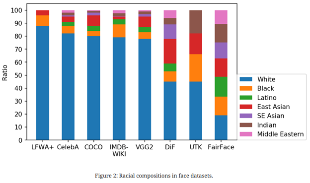
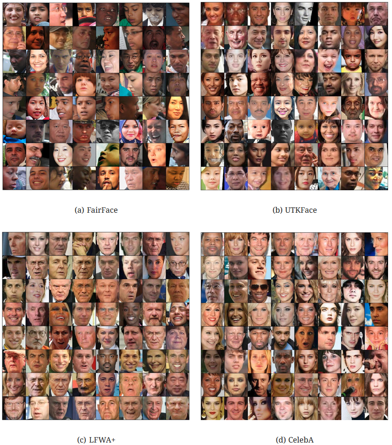
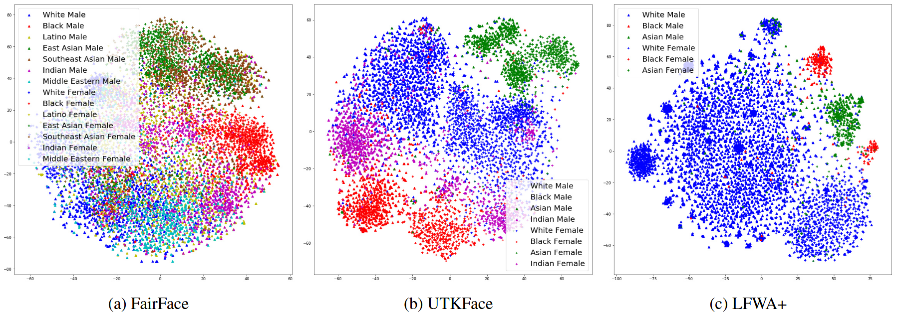
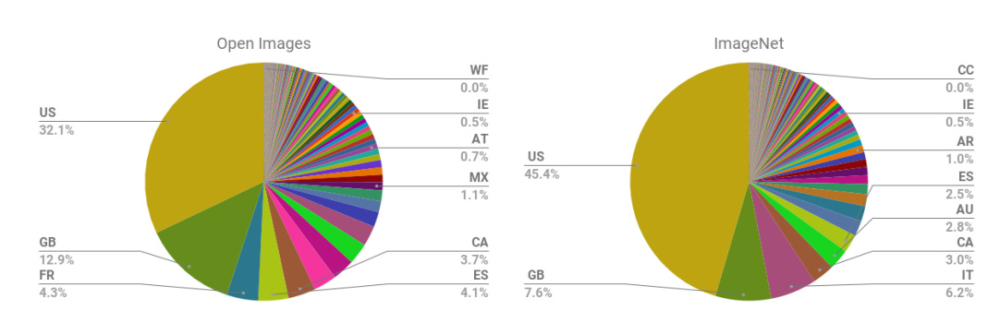
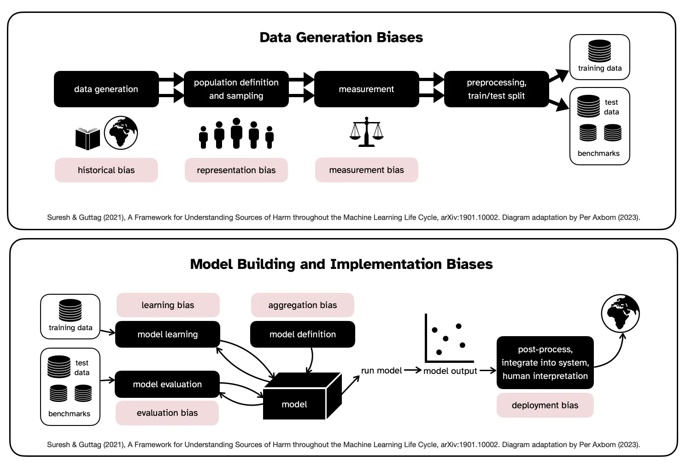

## Bias, Fairness, and Accountability

Deep learning systems do not learn in isolation. They learn from data created by us, shaped by our societies, and influenced by the assumptions and behaviours of different groups. When the data is unbalanced or reflects harmful stereotypes, the model can absorb those patterns. When the evaluation setup is incomplete, the model may appear accurate but behave unfairly in real-world situations. And when deployment decisions are made without thinking about accountability, people can be negatively affected.

Our goal in this notebook is to build an intuitive and structured understanding of how bias arises in machine learning systems and why fairness is not just a mathematical constraint but a foundational requirement for trustworthy AI.

To guide us, we focus on three questions:

1. **What kinds of bias can appear in datasets and trained models?**  
   We will use visual examples and real incidents to help us notice patterns, representation gaps, and underlying assumptions.

2. **Where in the machine learning pipeline does bias enter, and how do design choices amplify or reduce it?**  
   We will connect this to our earlier projects, especially to data preprocessing, model selection, and fine-tuning.

3. **What is the role of fairness and accountability in the lifecycle of a model?**  
   We will learn how concepts like statistical parity, equal opportunity, and disparate impact link to ethical principles of responsibility, transparency, and societal impact.

### **1. Where Does Bias Enter Machine Learning Pipelines?**

When we trained models in earlier projects, we worked with relatively clean and well-curated datasets. In real-world situations, however, machine learning systems often learn from data that reflects the historical, cultural, and societal patterns of the communities that created it. This means that a large part of what a model learns is not simply “pixel to label,” but a complex mixture of who gets represented, how often, and in what contexts.

A large portion of fairness research began by analyzing face datasets such as LFWA+, CelebA, COCO, IMDB-WIKI, VGG2, and UTKFace. One of the most influential papers in this space is the FairFace dataset paper (2019). It highlighted that many widely used face datasets were significantly unbalanced across racial groups.

Below is a figure from FairFace [1] illustrating the racial composition of common face datasets:

<

This chart reveals that several popular datasets are overwhelmingly composed of images of **White individuals**, with dramatically fewer examples of Black, Latino, East Asian, Southeast Asian, Indian, and Middle Eastern faces. When a model is trained on such a dataset, it forms a skewed internal representation of what “a face” statistically looks like. As a result, recognition accuracy for underrepresented groups tends to be lower—something repeatedly demonstrated in face recognition and fairness studies.

**1.2 How Representation Bias Shows up in Sample Images**

The imbalance we saw in the racial composition plot is not abstract—it becomes very clear when we look at random samples from each dataset.

Below we compare four face datasets (FairFace, UTKFace, LFWA+, CelebA) [1]:

<

We immediately notice visible differences:

- **FairFace** shows a wide distribution of age, skin tone, and ethnicity.  
- **UTKFace** is somewhat mixed but still uneven across groups.  
- **LFWA+ and CelebA** contain mostly White actors, celebrities, and public figures.

When a dataset is dominated by a few demographic groups, a model naturally internalizes those groups as the “default” or “expected” distribution. Everything outside that distribution becomes statistically rare, which leads to poorer performance in downstream tasks.

**1.3 Embedding-Space Evidence: What the Model Actually Learns**

If we go deeper and examine the *representations* learned by a deep network, we see even clearer evidence of dataset bias. The FairFace paper provided a series of t-SNE plots that show how face embeddings cluster by gender and ethnicity [1].

<

Each dot represents a face, and the model’s internal representation groups people with similar features. Notice how:

- Some datasets (like LFWA+) compress nearly all points into one dominant cluster, reflecting their lack of diversity.
- FairFace produces a richer and more evenly distributed embedding space, meaning the model has learned more balanced feature representations.

This reinforces the idea that dataset diversity directly affects the fairness and robustness of trained models.

**1.4 Geographic Bias in Large-Scale Image Datasets**

Bias is not only about faces. Many large-scale image datasets, such as ImageNet and OpenImages, are heavily skewed toward Western countries.

<

We can see that:

- More than **45% of ImageNet** images originate from the United States.  
- Many countries contribute less than 1% of the dataset.  
- This imbalance means the model learns a Western-centric worldview: objects, environments, clothing, food, and cultural artifacts common in non-Western countries are underrepresented or misrepresented.

This geographic skew affects everything from object detection to content moderation and image captioning.

**1.5 Generative Model Bias: How Modern AI Recreates Cultural Stereotypes**

Even when we move to modern generative systems (e.g., diffusion models, large generative transformers), bias persists. These models are trained on massive internet-scale datasets that inherit cultural stereotypes, overgeneralizations, and representational shortcuts.

For example, prompting a generative model with “a Mexican person” often yields nearly identical images following a stereotypical pattern.

This is not a mistake in the model—it is a learned pattern from the training data. If the internet predominantly represents Mexican people wearing sombreros, the model absorbs that pattern as a statistical truth.

Similarly, prompting “Indonesian food” often yields images that always feature banana leaves, despite Indonesia having a wide culinary diversity.

This illustrates how **models amplify culturally dominant representations**, even when those representations are narrow or stereotypical.

**1.6 Why All These Forms of Bias Matter**

The examples above demonstrate that bias can enter the pipeline long before we begin training, for example:

- **Representation bias**: certain groups appear more frequently or more visibly in the data.  
- **Sampling bias**: some categories dominate the dataset simply because they are easier to collect.  
- **Label bias**: annotations carry human assumptions and cultural norms.  
- **Context bias**: images taken in certain environments or lighting conditions represent only a subset of real-world scenarios.

These imbalances then cascade through the entire ML system:

- Models become less accurate for underrepresented groups.  
- Embedding spaces reflect cultural patterns rather than true visual diversity.  
- Generative systems reproduce stereotypes and amplify societal biases.  
- Downstream decisions—such as identity verification, hiring, or safety monitoring—can become unfair.

Our job in this project is to understand these mechanisms deeply so that we can design models and processes that reduce harm, increase robustness, and uphold fairness as a core design principle rather than an afterthought.

### **2. How Bias Flows Through the Machine Learning Pipeline**

Now that we have seen concrete examples of dataset bias, we step back and ask a more fundamental question: *where* in the machine learning process does this bias enter? 

Axbom (2023) presents a clear and intuitive diagram (adapted from Suresh & Guttag, 2021) that helps us understand the different points at which bias can appear. We will use this structure to build our intuition.

**2.1 The ML Bias Pipeline**

Below is the high-level pipeline showing **where bias enters before and during model building**, and even after deployment. 

<

This diagram breaks the lifecycle into two major stages:

1. **Data Generation Biases**  
2. **Model Building and Implementation Biases**

We will walk through each step in narrative form, using real examples from Section 1.

**2.2 Data Generation Biases**

Bias begins long before we train a model. It starts with how the data is produced, collected, labeled, and structured.

**a) Historical Bias**
Historical patterns, inequalities, and stereotypes become embedded in the dataset.  
Even when the dataset is an “accurate representation of the world,” it may still encode discrimination.

Historical bias is not fixed by collecting “more data” — because the underlying societal imbalance is still present.

**b) Representation Bias**
Some groups appear more frequently in the dataset than others.

This imbalance causes:

- underrepresented groups to be learned poorly  
- embedding spaces to cluster overwhelmingly around dominant groups  
- downstream errors in recognition or detection

Representation bias is one of the most common sources of harm.

**c) Measurement Bias**
This happens when **labels**, **annotations**, or **measurement instruments** are flawed.

Examples:

- Labeling “creditworthiness” using credit scores can encode socioeconomic inequality.  
- Crime prediction models using arrest records inherit policing bias.  
- Gender labels assigned from facial images are oversimplified and culturally dependent.  
- Occupation labels in datasets (e.g., “nurse”, “doctor”) historically skew toward stereotypes.

Measurement bias often goes unnoticed because it happens during labeling, not dataset collection.

**2.3 Model Building and Implementation Biases**

Once we begin model training, different forms of bias appear again — even if the dataset itself were perfectly balanced.

**a) Learning Bias**
During training, model optimization decisions (loss weighting, sampling strategies, architectures) can unintentionally prioritize the majority groups.

For example:
- A classifier may optimize global accuracy by performing very well on the majority group and poorly on minorities.  
- ImageNet-pretrained models may overfocus on texture features present mostly in Western imagery.

Learning bias often explains why even balanced datasets show uneven performance.

**b) Aggregation Bias**
This occurs when a **single model** is used for multiple subpopulations whose distributions differ.

Examples:
- A hiring model trained on “general sentiment” fails for people with different facial expression norms.
- A healthcare model performs worse for groups with different symptom profiles.  
- Embedding models collapse important distinctions (e.g., East Asian vs Southeast Asian features).

Aggregation bias is especially important in deployment settings like healthcare or justice systems.

**c) Evaluation Bias**
We measure the model on benchmark test sets — but if the benchmark is biased, our evaluation is biased too.

For example, Images of dark-skinned women comprise only 7.4% and 4.4% of common benchmark datasets Adience and IJB-A, and thus benchmarking on them fails to discover and penalize underperformance on this part of the population.

This means a model could be “state of the art” on paper, yet fail miserably for groups absent from the benchmark.

**d) Deployment Bias**
This occurs when the model is used in a context for which it was **not originally designed**. "This often occurs when a system is built and evaluated as if it were fully autonomous, while in reality, it operates in a complicated sociotechnical system moderated by institutional structures and human decision-makers" [8]. This is also known as the "framing trap". These tools can lead to harm because of automation or confirmation bias (example: Incorrect advice by an AI-based decision support system could impair the performance of radiologists when reading mammograms).

Deployment bias often emerges from misunderstanding the human-in-the-loop context.

**2.6 The Ecosystem of AI Harms: Beyond Technical Bias**

Real-world harm does not come only from technical flaws. It emerges from a much larger **ecosystem of social, organisational, and cultural factors** surrounding the model.

It helps us understand that fairness is not just about “fixing datasets.” Fairness depends on who builds the system, who deploys it, who is affected, and what structures surround the technology.

**A. Imagined Harms (science-fiction fear)**

These are the dramatic scenarios often highlighted in media:

- “AI will become conscious and destroy humanity.”  
- “Robots will take over the world.”  
- “Superintelligence will wipe out human life.”

These narratives attract attention, but they often distract us from the **immediate, concrete harms** already affecting people today. Imagined harms are emotionally powerful but do not represent the core fairness challenges we face in real deployments.

**B. Real Harms (already happening today)**

Examples include:

- **Discrimination** — facial recognition that performs poorly on darker-skinned women; hiring systems that downgrade certain groups.  
- **Surveillance** — tracking systems disproportionately deployed in low-income or minority communities.  
- **Stigmatization** — image models reinforcing cultural stereotypes.
- **Exclusion** — systems that simply do not work for groups missing from the training data.

These harms are not hypothetical. They arise because the technology is shaped by the data and assumptions baked into it. They disproportionately affect people who are underrepresented or historically marginalized.

**C. A System of Interacting Influences**

- **Organisation** — which goals, values, incentives drive the system?  
- **Supervision** — how decisions are monitored and governed?  
- **Environment** — political and cultural forces affecting development?  
- **Human** — who labels data, who collects it, who interprets outputs?  
- **Machine** — model architecture, training, evaluation, deployment?  
- **Society** — who is impacted, who benefits, who is harmed?

Bias does not originate from a single component.  
It emerges from their interaction — often invisibly.

When an ML system fails, it is rarely because “the algorithm is biased.”  
It is because **the ecosystem that produced the algorithm contained structural bias**, which the model absorbed and amplified.

**D. Why This Ecosystem View Matters**

This broader view adds two important insights to our technical pipeline:

1. **Bias is not only inside the data.**  
   It also stems from organisational and societal contexts.

2. **Technical fixes are not enough.**  
   Even a balanced dataset can produce harm if deployed without human oversight, accountability mechanisms, or cultural sensitivity.

This prepares us to think of fairness not as a mathematical constraint but as a **design principle** that involves ethical reasoning, interdisciplinary understanding, and responsible governance.

### **3. Real-World Case Studies of Algorithmic Bias**

These cases help us see that bias is not a theoretical issue — it shows up in deployed systems, influences decision-making, and affects people’s lives.

> **Our goal here is not to criticize specific organizations, but to understand why these failures occur and how we, as practitioners, can prevent them.**

**<u>3.1 Case Study 1 — Political Bias in Large Language Models</u>**

The figure shows how different pretrained language models tend to “sit” on a two-dimensional political map: a social axis (authoritarian ↔ libertarian) and an economic axis (left ↔ right). Each dot corresponds to a model such as BERT, RoBERTa, GPT-2, GPT-3, ChatGPT, or GPT-4. We see that different model families cluster in different regions of this space.

This does not mean that these models “hold political opinions.” Instead, the positions reflect statistical tendencies in their training data: news articles, social media posts, books, and websites that themselves contain ideological patterns. Because large language models learn from human-generated text, they inevitably absorb these patterns and reproduce them in subtle ways.

The key lesson is that models trained on uncurated text data may inherit, and sometimes amplify, the political leanings of the sources they are trained on. If we treat these models as neutral decision-makers, we risk introducing one-sided viewpoints into applications such as news summarization, political chatbots, content moderation, and recommendation systems.

**<u>3.2 Case Study 2 — COMPAS Recidivism Scoring Bias</u>**

The COMPAS system is a risk-assessment tool used by several courts in the United States to estimate the likelihood that a person will re-offend. Investigations showed that COMPAS produced systematically higher risk scores for Black defendants than for White defendants, even when we control for prior crimes and other factors.

In the dataset studied, 51% of individuals were Black, yet 59% of those who re-offended and were classified as “high risk” were Black. Further analysis revealed that:

- Black defendants were more likely to be labeled high risk even when they did not re-offend (higher false-positive rate).  
- White defendants were more likely to be labeled low risk even when they did re-offend (higher false-negative rate).

From a fairness perspective, this is deeply problematic. Two people with similar histories receive different risk labels, and therefore potentially different sentences or parole decisions, largely because of race-correlated patterns in the training data. The model is “accurate enough” overall, but the errors are not distributed fairly.

**<u>3.3 Case Study 3 — Google Photos and Vision Mislabeling Incidents</u>**

In 2015, Google Photos made headlines when it mislabeled photos of Black people as “gorillas.” This incident highlighted how a lack of diverse training data and insufficient auditing can lead to highly offensive and harmful mistakes. Later investigations into Google’s Vision API revealed additional, subtler examples of problematic behavior.

In one incident, we see a dark-skinned hand holding a monocular. The Vision model labels this image with terms including “gun.” When the skin is artificially lightened while keeping the object the same, the model’s predictions shift, and the label “monocular” becomes more prominent. The pixels have changed only in skin tone, yet the system interprets the scene differently.

This is an example of **measurement bias** and **representation bias** interacting:

- The training data appears to have overrepresented associations between darker skin and weapons.  
- The model relies on those associations when making predictions, even when they are inappropriate.

For safety-critical contexts such as surveillance, law enforcement, or content moderation, such misclassifications can have serious consequences, particularly for the groups already facing discrimination.

**<u>3.4 Case Study 4 — Twitter’s Image-Cropping Algorithm Bias</u>**

Twitter (now X) previously used an automated image-cropping algorithm to generate thumbnails. The system tried to crop images around the “most salient” region, often a face. However, users began noticing a pattern: when an image contained multiple faces, the crop frequently favored lighter-skinned faces or particular demographic groups.

Experiments with cartoon characters and dog photos showed that the cropping system had a systematic preference. Even when faces were equally sized and centrally placed, the algorithm often chose the lighter-skinned character or the lighter-colored dog. This made the bias obvious and easier to communicate.

The differences are not random noise; they reveal a consistent skew. The underlying saliency model appears to have been trained on data where certain skin tones, facial features, and image regions were more likely to be considered “important.”

This case illustrates that bias can surface even in seemingly minor UX decisions. A thumbnail might look like a small detail, but it determines which faces and bodies are highlighted in timelines, which in turn affects visibility, representation, and user experience.

**3.5 What These Cases Teach Us**

Across these four cases we notice some common patterns:

- **Data does not come from nowhere.** It is shaped by history, culture, and power structures. Models that learn from this data inherit those patterns.  
- **Errors are not evenly distributed.** Even when overall accuracy looks acceptable, certain groups may experience much higher error rates or more harmful mistakes.  
- **Design choices matter.** Whether we are predicting recidivism, labeling images, or cropping photos, the way we collect data, define labels, and evaluate performance strongly influences who is treated fairly.

### **4. Fairness Metrics and Responsible AI Frameworks**

- how fairness is defined,
- how it is measured,
- and how major industry frameworks (Microsoft, Google) guide responsible AI development.

Fairness is not a single number. It is a socio-technical property that emerges from **data**, **models**, **people**, and **institutions**. Metrics help us detect disparities, but human judgement is essential to interpret them.

**4.1 Why Do We Need Fairness Frameworks?**

Fairness problems rarely originate in isolation. They arise when:

- datasets reflect historical or social inequalities,
- model choices amplify or encode those inequalities,
- evaluation overlooks group-level disparities,
- deployment conditions differ from training conditions.

Because of this, many companies emphasize that fairness must be considered holistically. Metrics expose symptoms; principles help us decide what to do next. Here we are discussing about such frameworks from two IT giants, Microsoft and Google.

**4.2 Two Fundamental Types of Harm**

Microsoft frames unfairness in terms of **harm**, especially two main categories:

**1. Harm of allocation**: The system distributes resources or opportunities unevenly. Examples include loan approvals, job recommendations, and medical prioritisation.

**2. Harm of quality-of-service**: The system performs worse for certain groups. Examples include facial recognition failing on darker skin tones or speech recognition missing female voices more often.

These harms help us interpret what fairness metrics tell us.

**4.3 Group Fairness and Disparity Metrics**

Group fairness asks a simple but powerful question:

> Does the model behave differently for different demographic groups?

Microsoft introduces **disparity metrics** that compare performance across groups:

- accuracy disparity  
- error rate disparity  
- precision disparity  
- recall disparity  
- selection rate disparity (e.g., percentage of approved applicants)

**4.4 Formal Fairness Metrics (Parity Constraints)**

Fairness research defines several mathematical conditions describing how similar predictions should be across groups. These parity constraints appear across Microsoft’s and Google’s work.

**1. Demographic Parity**

A model satisfies demographic parity when positive prediction rates are equal:

$$
P(\hat{Y} = 1 \mid A = a) = P(\hat{Y} = 1 \mid A = b)
$$

Groups should receive positive predictions at similar rates.

**2. Equalized Odds**

A stricter condition requiring equal error behaviour:

$$
P(\hat{Y} = 1 \mid Y = y, A = a) = P(\hat{Y} = 1 \mid Y = y, A = b)
$$

This equalizes:

- true positive rates  
- false positive rates  

across groups.

**3. Equal Opportunity**

A relaxed form of equalized odds:

$$
P(\hat{Y} = 1 \mid Y = 1, A = a) = P(\hat{Y} = 1 \mid Y = 1, A = b)
$$

If someone *actually qualifies*, their chance of a correct prediction should not depend on group membership.

**Comparison Table**

| Fairness Metric | Equalizes | Protects Against | Typical Use |
|-----------------|-----------|------------------|--------------|
| **Demographic Parity** | Selection rates | Allocation harm | Hiring, loan approval |
| **Equal Opportunity** | True positive rates | Denial of qualified individuals | Healthcare triage |
| **Equalized Odds** | TPR and FPR | Unequal error patterns | High-stakes decisions |

**4.5 Fairness Mitigation Techniques**

Microsoft describes two major approaches:

**A. Reduction Algorithms (training-time)**  
Reweight or transform data to satisfy fairness constraints.

**B. Post-Processing (after training)**  
Adjust thresholds separately for groups without retraining the model.

These methods let us balance fairness and accuracy in a controlled way.

**4.6 Responsible AI Principles (Google + Microsoft)**

Google’s 2025 AI Responsibility update emphasizes the role of principles and governance:

- Fairness and inclusion  
- Transparency and explainability  
- Accountability and auditability  
- Safety and robustness  
- Ecological and societal well-being  

Where Microsoft provides the *metrics*, Google provides the *values* and *principles* that shape how we interpret them.

Together they form a complete framework:
**metrics → principles → governance → action**.

### **5. Accountability, Governance, and Human Responsibility**

> **Who is responsible for ensuring that AI systems behave fairly and safely?**

Bias is never just a bug in a model. It emerges from a wider ecosystem of **laws**, **organizational decisions**, and **technical practices**. To understand this, we use two complementary governance frameworks:

- UNESCO’s **Layered Structure of AI Governance**
- The **Hourglass Model of Organizational AI Governance**

Together, they show that fairness is a **shared, multi-layer responsibility** rather than something a single engineer can fix alone.

**<u>5.1 The Layered Structure of AI Governance (UNESCO)</u>**

UNESCO describes AI governance as three nested layers. Each layer shapes how AI systems are designed, deployed, and monitored.

**1. Environmental Layer – Society, Law, and Norms**

This outer layer includes:

- national and international AI regulations,
- human rights frameworks and ethical principles,
- cultural norms, public debate, and media scrutiny.

It sets the **external boundaries** for what AI systems are allowed to do. For example, the EU AI Act can ban certain “unacceptable risk” applications (such as social scoring) and impose strict conditions on “high-risk” systems.

**2. Organizational Layer – Institutions and Companies**

The organizational layer sits between high-level norms and concrete systems. Here, universities, companies, and public bodies translate external expectations into:

- internal AI policies and value statements,
- risk and impact assessment processes,
- roles and committees (e.g., AI ethics boards),
- documentation and audit practices.

If this translation fails, even technically well-designed models can still be deployed in harmful ways.

**3. AI System Layer – Data, Models, and Pipelines**

This inner layer is where we usually work as ML practitioners:

- data collection and preprocessing,
- model architecture and training,
- evaluation, deployment, and monitoring.

Bias becomes visible here (e.g., skewed accuracy across groups), but it is heavily influenced by decisions made in the outer layers.

**<u>5.2 The Hourglass Model of Organizational AI Governance</u>**

The Hourglass Model gives a more operational view of how governance flows through an organization. It looks like an hourglass because **broad external requirements** must pass through a **narrow “translation” layer** before they become **concrete operational practices**.

**Top of the Hourglass – External Requirements**

At the top, we have:

- **Hard law** (regulations, standards),
- **Principles and guidelines** (ethical codes, Responsible AI principles),
- **Stakeholder pressure** (NGOs, customers, affected communities).

These provide broad expectations but are often abstract.

**Middle – Strategic and Value Alignment**

The neck of the hourglass is where abstraction becomes actionable:

- **Strategic alignment** – how AI projects support the organization’s mission while respecting laws and ethics.
- **Value alignment** – how principles such as fairness, transparency, and privacy shape concrete choices.

This is where leadership decisions determine whether ethics is a “nice slide” or a real constraint on projects.

**Bottom – Operational Governance in the AI System Layer**

At the bottom, governance takes the form of everyday practices:

- AI system design and operations,
- algorithm design and documentation,
- risk and impact management,
- data operations and data quality checks,
- development operations (MLOps, deployment),
- transparency and contestation mechanisms,
- compliance, audits, and logging,
- clear **accountability** for who owns which decisions.

**<u>5.3 Governance as Shared Responsibility</u>**

Both frameworks emphasise that **no single actor controls fairness**. Instead, responsibilities are distributed:

| **Actor** | **Typical Responsibilities** |
|----------|------------------------------|
| **Developers / Data Scientists** | Curate data, design models, run fairness diagnostics, document limitations, monitor performance. |
| **Organizations / Universities** | Set AI strategy, create governance structures, allocate resources, approve or stop deployments. |
| **Regulators / Governments** | Define legal boundaries, certification schemes, reporting duties, and sanctions. |
| **Users / Society** | Notice and report harms, question unfair use, participate in consultations and public debate. |

If any link in this chain fails, unfair systems can be built and deployed even when the code “works” as intended.
